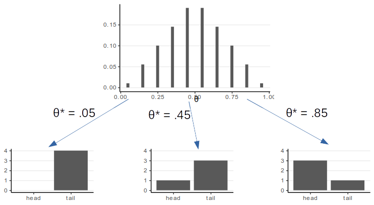

```{r, child = "slide_settings.RMarkdown"}
```

```{r xaringan-panelset, echo = FALSE}
xaringanExtra::use_panelset()
```

```{r xaringan-scribble, echo = FALSE, eval = params$for_class}
xaringanExtra::use_scribble()
```

# Inverse Probability

Conditional probability: $P(A \mid B) = \dfrac{P(A, B)}{P(B)}$

which yields $P(A, B) = P(A \mid B) P(B)$ (joint = conditional $\times$ marginal)

--

On the other side, $P(B \mid A) = \dfrac{P(B, A)}{P(A)}$

---

# Bayes' Theorem

$$P(B \mid A) = \dfrac{P(A \mid B) P(B)}{P(A)}$$

Which says how can go from $P(A \mid B)$ to $P(B \mid A)$

--

Consider $B_i$ $(i = 1, \ldots, n)$ as one of the many possible mutually exclusive events

\begin{align}
  P(B_i \mid A) & = \frac{P(A \mid B_i) P(B_i)}{P(A)}  \\
             & = \frac{P(A \mid B_i) P(B_i)}{\sum_{k = 1}^n P(A \mid B_k)P(B_k)}
\end{align}

---
class: clear

> A police officer stops a driver *at random* and does a breathalyzer test for the driver. The breathalyzer is known to detect true drunkenness 100% of the time, but in **1%** of the cases, it gives a *false positive* when the driver is sober. We also know that in general, for every **1,000** drivers passing through that spot, **one** is driving drunk. Suppose that the breathalyzer shows positive for the driver. What is the probability that the driver is truly drunk?

---
exclude: `r tolower(!params$for_class)`
class: clear

.pull-left[

$P(\text{positive} \mid \text{drunk}) = 1$  
$P(\text{positive} \mid \text{sober}) = 0.01$  

]

.pull-right[

$P(\text{drunk}) = 1 / 1000$  
$P(\text{sober}) = 999 / 1000$

]

--
exclude: `r tolower(!params$for_class)`

Using Bayes's Theorem, 

.font70[

\begin{align}
  & \quad\; P(\text{drunk} \mid \text{positive})  \\
  & = \frac{P(\text{positive} \mid \text{drunk}) P(\text{drunk})}
           {P(\text{positive} \mid \text{drunk}) P(\text{drunk}) + 
            P(\text{positive} \mid \text{sober}) P(\text{sober})}  \\
  & = \frac{1 \times 0.001}{1 \times 0.001 + 0.01 \times 0.999} \\
  & = 100 / 1099 \approx 0.091
\end{align}

]

--
exclude: `r tolower(!params$for_class)`

So there is less than 10% chance that the driver is drunk even when the 
breathalyzer shows positive.

---
exclude: `r tolower(!params$for_class)`
class: clear

> A. Even with the breathalyzer showing positive, it is still very likely that the driver is not drunk

> B. On the other hand, before the breathalyzer result, the person only has a 0.1% chance of being drunk. The breathalyzer result increases that probability to 9.1% (i.e., 91 times bigger)

--
exclude: `r tolower(!params$for_class)`

Both (A) and (B) are true. It just means that there is still much uncertainty after one positive test

???

Having a second test may be helpful, assuming that what causes a false positive in the first test does not guarantee a false positive in the second test (otherwise, the second test is useless). That's one reason for not having consecutive tests too close in time. 

---

# Gigerenzer (2004)

$p$ value = $P$(data | hypothesis), not $P$(hypothesis | data)

--

Consider:
- $H_0$: the person is sober (not drunk)
- data: breathalyzer result

$p$ = $P$(positive | sober) = 0.01 $\rightarrow$ reject $H_0$ at .05 level

--

However, as we have been, given that $P(H_0)$ is small, $P(H_0 \mid \text{data})$ is still small

---
class: inverse, middle, center

# Bayesian Data Analysis

---

# Bayes' Theorem in Data Analysis

- Bayesian statistics
    * more than applying Bayes's theorem
    * a way to quantify the plausibility of every possible value of some parameter $\theta$
        * E.g., population mean, regression coefficient, etc
    * Goal: **update one's Belief about $\theta$ based on the observed data $D$**

---
class: clear

### Going back to the example

Goal: Find the probability that the person is drunk, given the test result

Parameter (`\(\theta\)`): drunk (values: drunk, sober)

Data (`\(D\)`): test (possible values: positive, negative)

--

Bayes' theorem: $\underbrace{P(\theta \mid D)}_{\text{posterior}} = \underbrace{P(D \mid \theta)}_{\text{likelihood}} \underbrace{P(\theta)}_{\text{prior}} / \underbrace{P(D)}_{\text{marginal}}$

---
class: clear

Usually, the marginal is not given, so

$$P(\theta \mid D) = \frac{P(D \mid \theta)P(\theta)}{\sum_{\theta^*} P(D \mid \theta^*)P(\theta^*)}$$

- $P(D)$ is also called *evidence*, or the *prior predictive distribution*
    * E.g., probability of a positive test, regardless of the drunk status

---

# Example 2

```{r, eval = FALSE, echo = TRUE}
shiny::runGitHub("plane_search", "marklhc")
```

- Try choosing different priors. How does your choice affect the posterior?
- Try adding more data. How does the number of data points affect the posterior?

---
class: clear

The posterior is a synthesis of two sources of information: prior and data (likelihood)

Generally speaking, a narrower distribution (i.e., smaller variance) means more/stronger information
- Prior: narrower = more informative/strong
- Likelihood: narrower = more data/more informative

---
exclude: true

Exercise:

- Shiny app with a parameter (fixed)
- Ask students to formulate a prior distribution
- Flip a coin, and compute the posterior by hand (with R)
- Use the posterior as prior, flip again, and obtain the posterior again
- Compare to use the original prior with two coin flips (both numbers and plots)
- Flip 10 times, and show how the posterior change (using animation in `knitr`)

---

# Setting Priors

.font70[
- Flat, noninformative, vague
- Weakly informative: common sense, logic
- Informative: publicly agreed facts or theories
]

```{r, fig.width = 8.1, fig.asp = 1/3, out.width = '95%'}
dnorm_trunc <- function(x, mean = 0, sd = 1, ll = 0, ul = 1) {
  out <- dnorm(x, mean, sd) / (pnorm(ul, mean, sd) - pnorm(ll, mean, sd))
  out[x > ul | x < ll] <- 0
  out
}
p1 <- ggplot(tibble(x = c(0, 1)), aes(x = x)) +
  stat_function(fun = dunif) +
  ylim(0, 5) +
  labs(y = "", x = expression(theta), title = "Flat")
p2 <- ggplot(tibble(x = c(0, 1)), aes(x = x)) +
  stat_function(fun = dnorm_trunc, args = list(mean = .8, sd = .5)) +
  ylim(0, 5) +
  labs(y = "", x = expression(theta), title = "Weakly informative")
p3 <- ggplot(tibble(x = c(0, 1)), aes(x = x)) +
  stat_function(fun = dnorm_trunc, args = list(mean = .8, sd = .1)) +
  ylim(0, 5) +
  labs(y = "", x = expression(theta), title = "Informative")
gridExtra::grid.arrange(p1, p2, p3, ncol = 3)
```

> *Prior beliefs used in data analysis must be admissible by a skeptical scientific audience (Kruschke, 2015, p. 115)*

---

# Likelihood/Model/Data $P(D \mid \theta, M)$

> Probability of observing the data **as a function of the parameter(s)**

.font70[
- Also written as $L(\theta \mid D)$ or $L(\theta; D)$ to emphasize it is a function of $\theta$
- Also depends on a chosen model $M$: $P(D \mid \theta, M)$
]

```{r}
set.seed(1535)
ngrid <- 101
grid <- seq(0, 1, length.out = ngrid)
qnorm_trunc <- function(p, mean = 0, sd = 1, ll = 0, ul = 1) {
  cdf_ll <- pnorm(ll, mean = mean, sd = sd)
  cdf_ul <- pnorm(ul, mean = mean, sd = sd)
  qnorm(cdf_ll + p * (cdf_ul - cdf_ll), mean = mean, sd = sd)
}
rnorm_trunc <- function(n, mean = 0, sd = 1, ll = 0, ul = 1) {
  p <- runif(n)
  qnorm_trunc(p, mean = mean, sd = sd, ll = ll, ul = ul)
}
compute_lik <- function(x, pts = grid, sd = 0.2, binwidth = .01) {
  lik_vals <- vapply(x, dnorm_trunc,
    mean = pts, sd = sd,
    FUN.VALUE = numeric(length(pts))
  )
  lik <- apply(lik_vals, 1, prod)
  lik / sum(lik) / binwidth
}
x <- rnorm_trunc(10, mean = 0.3, sd = 0.2)
x1 <- x[1:2]
lik_x1 <- compute_lik(x1)
lik_x <- compute_lik(x)
p1 <- ggplot(
  tibble(x = grid, dens = lik_x1),
  aes(x = x, y = dens)
) +
  geom_line() +
  labs(x = expression(theta), y = "Likelihood (Scaled)",
       title = "2 data points") +
  geom_point(
    data = tibble(x = x1), aes(x = x), y = 0,
    shape = 1
  )
p2 <- ggplot(
  tibble(x = grid, dens = lik_x),
  aes(x = x, y = dens)
) +
  geom_line() +
  labs(x = expression(theta), y = "Likelihood (Scaled)",
       title = "10 data points") +
  geom_point(
    data = tibble(x = x), aes(x = x), y = 0,
    shape = 1
  )
gridExtra::grid.arrange(p1, p2, ncol = 2)
```

---

# Likelihood of Multiple Data Points

1. Given $D_1$, obtain *posterior* $P(\theta \mid D_1)$
2. Use $P(\theta \mid D_1)$ as *prior*, given $D_2$, obtain posterior $P(\theta \mid D_1, D_2)$

The posterior is the same as getting $D_2$ first then $D_1$, or $D_1$ and $D_2$ together, if

- **data-order invariance** is satisfied, which means
- $D_1$ and $D_2$ are **exchangeable**

---
class: clear

# Exchangeability

Joint distribution of the data does not depend on the order of the data

E.g., $P(D_1, D_2, D_3) = P(D_2, D_3, D_1) = P(D_3, D_2, D_1)$

Example of non-exchangeable data:

- First child = male, second = female vs. first = female, second = male
- $D_1, D_2$ from School 1; $D_3, D_4$ from School 2 vs. $D_1, D_3$ from School 1; $D_2, D_4$ from School 2

---
class: inverse, middle, center

# An Example With Binary Outcomes

---

# Coin Flipping

Q: Estimate the probability that a coin gives a head

- $\theta$: parameter, probability of a head

Flip a coin, showing head

- $y = 1$ for showing head

> How do you obtain the likelihood?

---

# Bernoulli Likelihood

The likelihood depends on the probability model chosen
- Some models are commonly used, for historical/computational/statistical reasons

One natural way is the **Bernoulli model**
$$\begin{align}
P(y = 1 \mid \theta) & = \theta \\
P(y = 0 \mid \theta) & = 1 - \theta
\end{align}$$

--

The above requires separating $y = 1$ and $y = 0$. A more compact way is
$$P(y \mid \theta) = \theta^y (1 - \theta)^{(1 - y)}$$

---

# Multiple Observations

Assume the flips are exchangeable given $\theta$,

$$\begin{align}
P(y_1, \ldots, y_N \mid \theta) &= \prod_{i = 1}^N P(y_i \mid \theta) \\
&= \theta^{\sum_{i = 1}^N y_i} (1 - \theta)^{\sum_{i = 1}^N (1 - y_i)} \\
&= \theta^z (1 - \theta)^{N - z}
\end{align}$$

$z$ = # of heads; $N$ = # of flips

> Note: the likelihood only depends on the number of heads, not the particular sequence of observations

---

# Posterior

### Same posterior, two ways to think about it

Prior belief, weighted by the likelihood

$$P(\theta \mid y) \propto \underbrace{P(y \mid \theta)}_{\text{weights}} P(\theta)$$

--

Likelihood, weighted by the strength of prior belief

$$P(\theta \mid y) \propto \underbrace{P(\theta)}_{\text{weights}} P(\theta \mid y)$$

---

# Posterior

Say $N$ = 4 and $z$ = 1

E.g., $P(\theta \mid y_1 = 1) \propto P(y_1 = 1 \mid \theta) P(\theta)$

.font70[
For pedagogical purpose, we'll discretize the $\theta$ into [.05, .15, .25, ..., .95]
- Also called **grid approximation**
]

.pull-left[
```{r prior-likelihood, out.width = "95%", fig.width = 4.07, fig.asp = .8}
tibble(
  th = seq(.05, .95, by = .10),
  pth = c(.01, .055, .10, .145, .19, .19, .145, .10, .055, .01)
) %>%
  mutate(py_th = th^1 * (1 - th)^4,
         py_th = py_th / sum(py_th)) %>%
  ggplot(aes(x = th)) +
  geom_col(aes(x = th - 0.01, y = pth, fill = "prior"),
    width = 0.02,
  ) +
  geom_col(aes(x = th + 0.01, y = py_th, fill = "scaled likelihood"),
    width = 0.02,
  ) +
  labs(fill = NULL, y = NULL, x = expression(theta)) +
  theme(legend.position = "top")
```
]

--

.pull-right[

```{r product, out.width = "95%", fig.width = 4.07, fig.asp = .8}
tibble(
  th = seq(.05, .95, by = .10),
  pth = c(.01, .055, .10, .145, .19, .19, .145, .10, .055, .01)
) %>%
  mutate(py_th = th^1 * (1 - th)^4,
         py_th = py_th / sum(py_th)) %>%
  ggplot(aes(x = th)) +
  geom_col(aes(x = th, y = pth * py_th), width = 0.02) +
  labs(fill = NULL, y = NULL, title = "Prior x Likelihood",
       x = expression(theta))
```

]

---

# How About the Denominator?

Numerator: relative posterior plausibility of the $\theta$ values

We can avoid computing the denominator because
- The sum of the probabilities need to be 1

--

So, for **discrete** parameters:

- Posterior probabilitiy = relative plausibility / sum of relative plausibilities

--

However, the denominator is useful for computing the *Bayes factor*

---

# Summarizing a Posterior Distribution

.font70[
Simulate (i.e., draw samples) from the posterior distribution
]

.panelset[
.panel[.panel-name[R code]

```{r simulate-post-draws, echo = TRUE}
th <- seq(.05, .95, by = .10)
pth <- c(.01, .055, .10, .145, .19, .19, .145, .10, .055, .01)
py_th <- th^1 * (1 - th)^4
pth_y_unscaled <- pth * py_th
pth_y <- pth_y_unscaled / sum(pth_y_unscaled)
post_samples <- sample(th,
  size = 1000, replace = TRUE,
  prob = pth_y
)
```

]

.panel[.panel-name[Summary]

```{r summarize-post-draws, out.width = "60%", fig.width = 5.14}
summ_draw <- function(x) {
  c(mean = mean(x),
    median = median(x),
    sd = sd(x),
    mad = mad(x),
    `ci.1` = quantile(x, prob = .1, names = FALSE),
    `ci.9` = quantile(x, prob = .9, names = FALSE))
}
ggplot(tibble(th = post_samples), aes(x = th)) +
  geom_bar(aes(y = ..prop..), width = 0.01) +
  geom_errorbarh(aes(
    y = 0.03, xmin = .148, xmax = .552,
    height = 0.01,
  ), col = "red") +
  annotate("text",
    x = .350, y = 0.04,
    label = "94.0% HDI", col = "red"
  ) +
  labs(x = expression(theta), y = expression(P(theta ~ "|" ~ y)))
summ_draw(post_samples)
```

]
]

---
class: clear

### Influence of more samples

$N$ = 40, $z$ = 10

.pull-left[
```{r prior-likelihood-2, out.width = "95%", fig.width = 4.07, fig.asp = .8}
tibble(
  th = seq(.05, .95, by = .10),
  pth = c(.01, .055, .10, .145, .19, .19, .145, .10, .055, .01)
) %>%
  mutate(py_th = th^10 * (1 - th)^40,
         py_th = py_th / sum(py_th)) %>%
  ggplot(aes(x = th)) +
  geom_col(aes(x = th - 0.01, y = pth, fill = "prior"),
    width = 0.02,
  ) +
  geom_col(aes(x = th + 0.01, y = py_th, fill = "scaled likelihood"),
    width = 0.02,
  ) +
  labs(fill = NULL, y = NULL, x = expression(theta)) +
  theme(legend.position = "top")
```
]

--

.pull-right[

```{r product-2, out.width = "95%", fig.width = 4.07, fig.asp = .8}
tibble(
  th = seq(.05, .95, by = .10),
  pth = c(.01, .055, .10, .145, .19, .19, .145, .10, .055, .01)
) %>%
  mutate(py_th = th^10 * (1 - th)^40,
         py_th = py_th / sum(py_th)) %>%
  ggplot(aes(x = th)) +
  geom_col(aes(x = th, y = pth * py_th), width = 0.02) +
  labs(fill = NULL, y = NULL, title = "Prior x Likelihood",
       x = expression(theta))
```

]

---
class: clear

### Influence of more informative priors

$N$ = 4, $z$ = 1

.pull-left[
```{r prior-likelihood-3, out.width = "95%", fig.width = 4.07, fig.asp = .8}
tibble(
  th = seq(.05, .95, by = .10),
  pth = c(.002, .008, .02, .09, .38, .38, .09, .02, .008, .002)
) %>%
  mutate(py_th = th^1 * (1 - th)^4,
         py_th = py_th / sum(py_th)) %>%
  ggplot(aes(x = th)) +
  geom_col(aes(x = th - 0.01, y = pth, fill = "prior"),
    width = 0.02,
  ) +
  geom_col(aes(x = th + 0.01, y = py_th, fill = "scaled likelihood"),
    width = 0.02,
  ) +
  labs(fill = NULL, y = NULL, x = expression(theta)) +
  theme(legend.position = "top")
```
]

--

.pull-right[

```{r product-3, out.width = "95%", fig.width = 4.07, fig.asp = .8}
tibble(
  th = seq(.05, .95, by = .10),
  pth = c(.002, .008, .02, .09, .38, .38, .09, .02, .008, .002)
) %>%
  mutate(py_th = th^1 * (1 - th)^4,
         py_th = py_th / sum(py_th)) %>%
  ggplot(aes(x = th)) +
  geom_col(aes(x = th, y = pth * py_th), width = 0.02) +
  labs(fill = NULL, y = NULL, title = "Prior x Likelihood",
       x = expression(theta))
```

]

--

The prior needs to be well justified

---

# Prior Predictive Distribution

> Bayesian models are **generative**

Simulate data from the prior distribution to check whether the data fit our intuition

- Clearly impossible values/patterns?

- Overly restrictive?

---
class: clear

$P(y) = \int P(y | \theta^*) P(\theta^*) d \theta^*$: Simulate a $\theta^*$ from the prior, then simulate data based on $\theta^*$

```{r prior-predictive, out.width = "80%"}

```

```{r, eval = FALSE}
# For creating the prior predictive figure
tibble(
  th = seq(.05, .95, by = .10),
  pth = c(.01, .055, .10, .145, .19, .19, .145, .10, .055, .01)
) %>%
  ggplot(aes(x = th)) +
  geom_col(aes(x = th, y = pth),
    width = 0.02,
  ) +
  labs(x = expression(theta), y = NULL)
ggsave("prior-theta.svg", width = 3.6, height = 2.22)
tibble(
  x = c("head", "tail"),
  y = c(0, 4)
) %>%
  ggplot(aes(x = x, y = y)) +
  geom_col() +
  labs(x = NULL, y = NULL)
ggsave("prior-predict-1.svg", width = 2, height = 1.24)
tibble(
  x = c("head", "tail"),
  y = c(1, 3)
) %>%
  ggplot(aes(x = x, y = y)) +
  geom_col() +
  ylim(0, 4) +
  labs(x = NULL, y = NULL)
ggsave("prior-predict-2.svg", width = 2, height = 1.24)
tibble(
  x = c("head", "tail"),
  y = c(3, 1)
) %>%
  ggplot(aes(x = x, y = y)) +
  geom_col() +
  ylim(0, 4) +
  labs(x = NULL, y = NULL)
ggsave("prior-predict-3.svg", width = 2, height = 1.24)
```

---
class: inverse, middle, center

# Criticism of Bayesian Methods

---

# Criticism of "Subjectivity"

Main controversy: subjectivity in choosing a prior

- Two people with the same data can get different results because of different chosen priors

---

# Counters to the Subjectivity Criticism

- With enough data, different priors hardly make a difference

- Prior: just a way to express the degree of ignorance
    * One can choose a weakly informative prior so that the Influence of subjective Belief is small

---
    
# Counters to the Subjectivity Criticism 2
    
Subjectivity in choosing a prior is

- Same as in choosing a model, which is also done in frequentist statistics

- Relatively strong prior needs to be justified, 
    * Open to critique from other researchers

- Inter-subjectivity $\rightarrow$ Objectivity

---

# Counters to the Subjectivity Criticism 3
    
The prior is a way to incorporate previous research efforts to accumulate scientific evidence

> Why should we ignore all previous literature every time we conduct a new study?