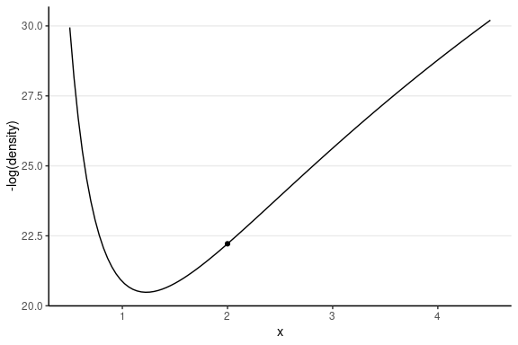

class: inverse, middle, center

```{r, child = "slide_settings.RMarkdown"}
```

```{r xaringan-panelset, echo = FALSE}
xaringanExtra::use_panelset()
```

```{r xaringan-scribble, echo = FALSE, eval = params$for_class}
xaringanExtra::use_scribble()
```

# Hamiltonian Monte Carlo (HMC)

---
exclude: `r !params$for_class`
class: clear

.pull-left[

Metropolis


    
]

.pull-right[

Hamiltonian


]

---
class: clear

From Hamiltonian mechanics

- Use *gradients* to generate better proposal values

Results:

- Higher acceptance rate
- Less autocorrelation/higher ESS
- Better suited for high dimensional problems

---
exclude: `r !params$for_class`

# Joint Density

```{r joint-dens, echo = FALSE, out.width = "90%", fig.asp = 1}
library(plotly)  # for 3D plot
ybar <- 3.096129
s2y <- 1.356451
n <- 31
# Hyperparameters
mu_0 <- 5
sigma2_0 <- 1
kappa_0 <- 1 / 10^2
nu_0 <- 1
# Joint log density
lp_mu_sigma <- function(mu, sigma2) {
    kappa_n <- kappa_0 + n
    mu_n <- (kappa_0 * mu_0 + n * ybar) / kappa_n
    nu_n <- nu_0 + n
    sigma2_n <- (nu_0 * sigma2_0 + (n - 1) * s2y +
        kappa_0 * n / kappa_n * (ybar - mu_0)^2) / nu_n
    log_dens <- -(mu - mu_n)^2 / 2 / sigma2 * kappa_n +
        (-nu_n / 2 - 1) * log(sigma2) +
        (-nu_n * sigma2_n / 2 / sigma2)
    log_dens[is.nan(log_dens)] <- -Inf
    log_dens
}

num_gridpoints <- 51
mu_grid <- seq(2, to = 4, length.out = num_gridpoints)
sigma2_grid <- seq(0.5, to = 4.5, length.out = num_gridpoints)
grid_density <- exp(outer(mu_grid,
    Y = sigma2_grid,
    FUN = lp_mu_sigma
))
plot_ly(
    x = ~sigma2_grid, y = ~mu_grid, z = ~grid_density,
    type = "surface"
)
```

---
exclude: `r !params$for_class`

# Gradients of Log Density

```{r persp-logdensity, echo = FALSE, out.width = "100%", fig.asp = 1}
grid_logdensity <- outer(mu_grid,
    Y = sigma2_grid,
    FUN = lp_mu_sigma
)
plot_ly(
    x = ~sigma2_grid, y = ~mu_grid, z = ~grid_logdensity,
    type = "surface"
)
```

---

# Gradients of Log Density

Consider just $\sigma^2$

Potential energy = $-\log P(\theta)$

> Which one has a higher **potential energy**?

```{r lp_sigma, echo = FALSE, fig.asp = 0.4, out.width = '100%', fig.width = 8.57}
# Potential energy
lp_sigma <- function(sigma2) {
    kappa_n <- kappa_0 + n
    nu_n <- nu_0 + n
    sigma2_n <- (nu_0 * sigma2_0 + (n - 1) * s2y +
        kappa_0 * n / kappa_n * (ybar - mu_0)^2) / nu_n
    log_dens <- (-nu_n / 2 - 1) * log(sigma2) +
        (-nu_n * sigma2_n / 2 / sigma2)
    log_dens[is.nan(log_dens)] <- -Inf
    log_dens
}
p2 <- ggplot(data = data.frame(x = c(0.5, 4.5)), aes(x = x)) +
    stat_function(fun = function(x) - lp_sigma(x))
p3 <- p2 +
    geom_point(
        x = 0.6, y = -lp_sigma(0.6),
        size = 2
    )
p4 <- p2 +
    geom_point(
        x = 1.4, y = -lp_sigma(1.4),
        size = 2
    )
gridExtra::grid.arrange(p3, p4, ncol = 2)
```

---

# HMC Algorithm

Imagine a marble on a surface like the log posterior

1. Simulate a random *momentum* (usually from a normal distribution)
2. Apply the momentum to the marble to roll on the surface
3. Treat the position of the marble after some time as the *proposed value*
4. Accept the new position based on the Metropolis step 
    * i.e., probabilistically using the posterior density ratio

---

# Leapfrog Integrator

Location and velocity constantly change

```{r leapfrog-animate-cached}

```

---
class: clear

### Leapfrog integrator

- Solve for the new location using $L$ leapfrog steps
- Larger $L$, more accurate location
- Higher curvature requires larger $L$ and smaller *step size*

```{r leapfrog, echo = FALSE}
leapfrog_step <- function(x, rho, num_steps, eps = 1 / num_steps) {
    out <- data.frame(x = rep(NA, num_steps + 1),
                      rho = rep(NA, num_steps + 1))
    out[1, ] <- c(x, rho)
    kappa_n <- kappa_0 + n
    nu_n <- nu_0 + n
    sigma2_n <- (nu_0 * sigma2_0 + (n - 1) * s2y +
        kappa_0 * n / kappa_n * (ybar - mu_0)^2) / nu_n
    for (i in seq_len(num_steps)) {
        rho <- rho - eps / 2 *
            ((nu_n / 2 + 1) / x - nu_n * sigma2_n / 2 / x^2)
        x <- x + eps * rho
        rho <- rho - eps / 2 *
            ((nu_n / 2 + 1) / x - nu_n * sigma2_n / 2 / x^2)
        out[i + 1, ] <- c(x, rho)
    }
    out
}
```

```{r leapfrog-steps, echo = FALSE, fig.asp = 0.4}
num_steps <- 3
leapfrog_df <- cbind(
    leapfrog_step(3, rho = -0.5, num_steps = num_steps),
    step = 0:num_steps
)
final_x <- leapfrog_step(3, rho = -0.5, num_steps = 1000)[1001, 1]
p5 <- p2 + geom_point(
    data = leapfrog_df,
    aes(x = x, y = -lp_sigma(x)), col = "green"
) +
    geom_point(
        x = final_x, y = -lp_sigma(final_x),
        col = "red", size = 2, shape = 21
    ) +
    geom_path(
        data = leapfrog_df,
        aes(x = x, y = -lp_sigma(x)), col = "green"
    ) +
    labs(y = "-log(density)")
num_steps <- 10
leapfrog_df <- cbind(
    leapfrog_step(3, rho = -0.5, num_steps = num_steps),
    step = 0:num_steps
)
p6 <- p2 + geom_point(
    data = leapfrog_df,
    aes(x = x, y = -lp_sigma(x)), col = "green"
) +
    geom_point(
        x = final_x, y = -lp_sigma(final_x),
        col = "red", size = 2, shape = 21
    ) +
    geom_path(
        data = leapfrog_df,
        aes(x = x, y = -lp_sigma(x)), col = "green"
    ) +
    labs(y = "-log(density)")
gridExtra::grid.arrange(p5, p6, ncol = 2)
```

*Divergent transition*: When the leapfrog approximation deviates substantially from where it should be

---

# No-U-Turn Sampler (NUTS)

Algorithm used in STAN

Two problems of HMC

- Need fine-tuning $L$ and **step size**
- Wasted steps when the marble makes a U-turn

--

NUTS uses a binary search tree to determine $L$ and the **step size**

- The **maximum treedepth** determines how far it searches

See a demo here: https://chi-feng.github.io/mcmc-demo/app.html

---
class: inverse, middle, center

# Stan

---

# Stan

A language for doing MCMC sampling (and other related methods, such as maximum likelihood estimation)

Current version (2.29): mainly uses NUTS

--

It supports a wide range of distributions and prior distributions

Written in C++ (faster than R)

---
class: clear

Consider the example

.pull-left[

Model:
$$\text{wc_laptop}_i \sim N(\mu, \sigma)$$
Prior:
\begin{align}
    \mu & \sim N(5, 10) \\
    \sigma & \sim t_4^+(0, 3)
\end{align}

]

.pull-right[

.font70[
$t_4^+(0, 3)$ is a half-`\(t\)` distribution with df = 4 and scale = 3
]

```{r t-plus, fig.width = 4.28, out.width = "100%", fig.asp = 1}
ggplot() +
    stat_function(
        aes(col = "half-t with df = 4, scale = 3"),
        fun = function(x) dt(x / 3, df = 4) * 2/ 3
    ) +
    stat_function(
        aes(col = "half-normal with sd = 3"),
        fun = function(x) dnorm(x, sd = 3) * 2
    ) +
    xlim(0, 15) +
    labs(col = NULL, x = expression(sigma),
         y = "density") +
    theme(legend.position = "bottom")
```

]

---
class: clear

### An example STAN model

.font70[

```{stan normal_mod, code = readLines("stan/normal_model.stan"), echo = TRUE, eval = FALSE, output.var = "norm_mod"}
```

]

---

# Components of a STAN Model

- `data`: Usually a list of different types
    * `int`, `real`, `matrix`, `vector`, `array`  
    can set lower/upper bounds
- `parameters`
- `transformed parameters`: optional variables that are transformation of the model parameters
- `model`: definition of **priors** and the **likelihood**
- `generated quantities`: new quantities from the model (e.g., simulated data)

---

# RStan

https://mc-stan.org/users/interfaces/rstan

An interface to call Stan from R, and import results from STAN to R

---

# Call `rstan`

.panelset[
.panel[.panel-name[R code]

.font70[

```{r rstan-ex, echo = TRUE, eval = FALSE}
library(rstan)
rstan_options(auto_write = TRUE)  # save compiled STAN object
nt_dat <- haven::read_sav("https://osf.io/qrs5y/download")
wc_laptop <- nt_dat$wordcount[nt_dat$condition == 0] / 100
# Data: a list with names matching the Stan program
nt_list <- list(
  N = length(wc_laptop),  # number of observations
  y = wc_laptop  # outcome variable (yellow card)
)
# Call Stan
norm_prior <- stan(
    file = "stan/normal_model.stan",
    data = nt_list,
    seed = 1234  # for reproducibility
)
```

]
]

.panel[.panel-name[Output]

.font50[

```{r, ref.label = "rstan-ex", echo = FALSE, eval = TRUE}
```

]
]
]
