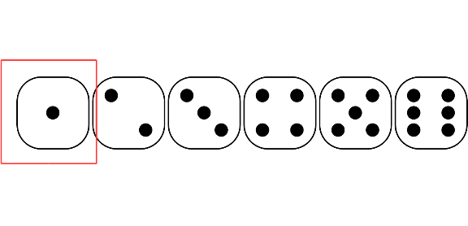

exclude: `r !params$for_class`

class: clear, inverse
background-image: url(https://upload.wikimedia.org/wikipedia/commons/2/28/Casino_Lights_In_Macau.jpg)
background-position: center
background-size: contain

```{r, child = "slide_settings.RMarkdown"}
```

```{r xaringan-panelset, echo = FALSE}
xaringanExtra::use_panelset()
```

```{r xaringan-scribble, echo = FALSE, eval = params$for_class}
xaringanExtra::use_scribble()
```

???

Image credit: [Wikimedia Commons](https://commons.wikimedia.org/wiki/File:Casino_Lights_In_Macau.jpg)

---

# History of Probability

- A mathematical way to study uncertainty/randomness

- Origin: To study gambling problems

---
class: clear

> Someone asks you to play a game. The person will flip a coin. You win $10 if it shows head, and lose $10 if it shows tail. Would you play?

```{r, out.width = '40%'}
knitr::include_graphics(
    "https://upload.wikimedia.org/wikipedia/commons/6/61/10_Avos_2007_Macao.jpg"
)
```

--
exclude: `r !params$for_class`

Why do you think it is (not) a fair gamble?

???

Image credit: [Wikimedia Commons](https://commons.wikimedia.org/wiki/File:10_Avos_2007_Macao.jpg)

---

# Kolmogorov Axioms

For an event $A_i$ (e.g., getting a "1" from throwing a die)

- $P(A_i) \geq 0$  [All probabilities are non-negative]

- $P(A_1 \cup A_2 \cup \cdots) = 1$  [Union of all possibilities is 1]

- $P(A_1) + P(A_2) = P(A_1 \text{ or } A_2)$ for mutually exclusive $A_1$ and $A_2$ [Addition rule]

---

# Throwing a Die With Six Faces

```{r, out.width = '80%'}

```

$A_1$ = getting a one, . . . $A_6$ = getting a six

- $P(A_i) \geq 0$
- $P(\text{the number is 1, 2, 3, 4, 5, or 6}) = 1$
- $P(\text{the number is 1 or 2}) = P(A_1) + P(A_2)$

Mutually exclusive: $A_1$ and $A_2$ cannot both be true

---
exclude: `r !params$for_class`
class: clear

> Consider two events: $A$ = Hok is Asian and $B$ = Hok is American. Are $A$ and $B$ mutually exclusive?

--

> There is a one-half chance for a sunny day tomorrow and a one-fourth chance for a cloudy day. What is the probability that tomorrow is either sunny or cloudy?

---
exclude: true

# Pascal's Wager


|     | Believe in God | Don't believe in God |
|-----|----------------|----------------------|
| God exists | Gain everything   | Status quo |
| God does not exist | Lose/Misery | Status quo |

.footnote[

https://plato.stanford.edu/entries/pascal-wager/

]

???

Image credit: [Wikimedia Commons](https://commons.wikimedia.org/wiki/File:Blaise_pascal.jpg)

---
class: inverse, middle, center

# Interpretations of Probability


---

# Ways to Interpret Probability

- **Classical:** Counting rules

- **Frequentist:** long-run relative frequency

- **Subjectivist:** Rational belief

.footnote[

Note: there are other paradigms to interpret probability. See https://plato.stanford.edu/entries/probability-interpret/

]

---

# Classical Interpretation

```{r, out.width = '80%'}

```

- Number of target outcomes / Number of possible "indifferent" outcomes
    * E.g., Probability of getting "1" when throwing a die: 1 / 6

---

# Frequentist Interpretation

- Long-run relative frequency of an outcome

.left-column[

.font70[
```{r}
set.seed(5)
die_outcome <- sample(1:6, 1e4, replace = TRUE)
knitr::kable(cbind(Trial = 1:10, Outcome = die_outcome[1:10]),
             align = c("c", "c"))
```
]

--

]

.right-column[
```{r, fig.width = 5.5, fig.asp = 0.8, out.width = '85%'}
p0 <- ggplot(
    tibble(x = 1:10, y = die_outcome[1:10]),
    aes(x = x, y = cumsum(y == 1) / x)
) +
    geom_line() +
    labs(x = "Number of trials", y = 'Relative frequency of "1"')
p1 <- p0 + geom_point() +
    scale_x_continuous(breaks = 1:10)
p2 <- p0 %+% tibble(x = 1:100, y = die_outcome[1:100]) +
    geom_hline(yintercept = 1 / 6, col = "red", linetype = "dashed")
p3 <- p0 %+% tibble(x = 1:1e3, y = die_outcome[1:1e3]) +
    geom_hline(yintercept = 1 / 6, col = "red", linetype = "dashed")
p4 <- p0 %+% tibble(x = 1:1e4, y = die_outcome) +
    geom_hline(yintercept = 1 / 6, col = "red", linetype = "dashed")
gridExtra::grid.arrange(p1, p2, p3, p4, nrow = 2)
```
]

---
exclude: `r !params$for_class`
class: clear

When flipping a fair coin, we say that "the probability of flipping Heads is 0.5." How do you interpret this probability?

> A. If I flip this coin over and over, roughly 50% will be Heads.

> B. Heads and Tails are equally plausible.

---
class: clear

### Problem of the single case: Some events cannot be repeated

- Probability of Democrats/Republicans "winning" the 2022 election

- Probability of the LA Rams winning the 2022 Super Bowl

--

- Probability that the null hypothesis is true

--

&zwj;Frequentist: probability is not meaningful for these

---

exclude: `r !params$for_class`
class: clear

An election is coming up and a pollster claims that candidate A has a 0.9 probability of winning. How do you interpret this probability?

> A. If we observe the election over and over, candidate A will win roughly 90% of the time.

> B. Candidate A is much more likely to win than to lose.

> C. The pollster’s calculation is wrong. Candidate A will either win or lose, thus their probability of winning can only be 0 or 1.

---

# Subjectivist Interpretation

- State of one's mind; the belief of all outcomes
    * Subjected to the constraints of:
        * Axioms of probability
        * That the person possessing the belief is rational
        
```{r, fig.width = 7.7, fig.asp = 0.4, out.width = '90%'}
p0 <- ggplot(tibble(x = 1:6, y = 1 / 6), aes(x = x, y = y)) +
    ylim(0, 0.5)
p1 <- p0 +
    geom_bar(stat = "identity") +
    labs(y = "Probability", x = "Person A")
p2 <- p0 %+% tibble(x = 1:6, y = c(.25, rep(.75 / 5, 5))) +
    geom_bar(stat = "identity", fill = "skyblue") +
    labs(y = "Probability", x = "Person B")
gridExtra::grid.arrange(p1, p2, ncol = 2)
```

---

# Describing a Subjective Belief

- Assign a value for every possible outcome
    * Not an easy task

- Use a *probability distribution* to approximate the belief
    * Usually by following some conventions
    * Some distributions preferred for computational efficiency

Key to forming *prior* distributions

---
class: inverse, middle, center

# Probability Distribution

---

# Probability Distributions

- Discrete outcome: Probability **mass**

- Continuous outcome: Probability **density**

```{r prob-mass-density, fig.retina = 2, fig.asp = 0.5, out.width = "90%", fig.width = 7.7}
# Probability mass
two_dice_probs <- data.frame(x = 2:12,
                             prob = c(table(outer(1:6, 1:6, FUN = "+"))) / 36)
p_mass <- ggplot(two_dice_probs, aes(x = x, y = prob)) +
    geom_col(width = 0.05) +
    geom_point() +
    scale_x_continuous(breaks = 2:12) +
    labs(x = "Sum of two dice", y = "Probability mass")
# Probability density
shaded <- data.frame(x = seq(80, 80.5, length.out = 11))
shaded$dens <- dnorm(shaded$x, mean = 78, sd = 5)
p_dens <- ggplot(data.frame(x = c(75, 85)), aes(x = x)) +
    stat_function(fun = dnorm, args = list(mean = 78, sd = 5)) +
    geom_ribbon(data = shaded, aes(ymin = 0, ymax = dens), alpha = 0.3) +
    labs(x = "Score", y = "Probability density")
gridExtra::grid.arrange(p_mass, p_dens, ncol = 2)
```

---

# Probability Density

- If $X$ is continuous, the probability of $X$ having any particular value $\to$ 0
    * E.g., probability a person's height is 174.3689 cm

Density: 
$$P(x_0) = \lim_{\Delta x \to 0} \frac{P(x_0 < X < x_0 + \Delta x)}{\Delta x}$$

---

# Normal Probability Density

.panelset[
.panel[.panel-name[Math]

$$P(x) = \frac{1}{\sqrt{2 \pi} \sigma} \exp\left(-\frac{1}{2}\left[\frac{x - \mu}{\sigma}\right]^2\right)$$

```{r, out.width = "50%", fig.width = 4.29}
ggplot(tibble(x = c(-3, 3)), aes(x = x)) +
    stat_function(fun = dnorm) +
    labs(title = "Normal(mu = 0, sigma = 1)", y = "Density")
```

]

.panel[.panel-name[R Code]

```{r, eval = FALSE, echo = TRUE}
my_normal_density <- function(x, mu, sigma) {
    exp(- ((x - mu) / sigma) ^2 / 2) / (sigma * sqrt(2 * pi))
}
```

]
]

---

# Some Commonly Used Distributions


???

Image credit: [Wikimedia Commons](https://commons.wikimedia.org/wiki/File:Relationships_among_some_of_univariate_probability_distributions.jpg)

---

# Summarizing a Probability Distribution

### Central tendency

The center is usually the region of values with high plausibility

- Mean, median, mode

--

### Dispersion

How concentrated the region with high plausibility is

- Variance, standard deviation
- Median absolute deviation (MAD)

---
class: clear

### Interval

- One-sided
- Symmetric
- Highest density interval (HDI)

```{r interval, echo = FALSE}
hdi_lower <- optim(.1,
                   function(a) diff(qchisq(c(a, .8 + a), df = 4)),
                   method = "L-BFGS-B",
                   lower = 0, upper = .2)$par
ggplot(data.frame(x = c(0, 10)), aes(x = x)) +
    stat_function(fun = dchisq, args = list(df = 4)) +
    geom_errorbarh(aes(xmin = 0, xmax = qchisq(.8, df = 4),
                       y = 0, height = 0.02,
                       color = "80% One-sided",
                       linetype = "80% One-sided")) +
    geom_errorbarh(aes(xmin = qchisq(.1, df = 4),
                       xmax = qchisq(.9, df = 4),
                       y = 0.03, height = 0.02,
                       color = "80% Symmetric",
                       linetype = "80% Symmetric")) +
    geom_errorbarh(aes(xmin = qchisq(hdi_lower, df = 4),
                       xmax = qchisq(hdi_lower + .8, df = 4),
                       y = 0.06, height = 0.02,
                       color = "80% HDI",
                       linetype = "80% HDI")) +
    labs(y = "Probability density", col = NULL, linetype = NULL)
```

---
class: inverse, middle, center

# Probability with Multiple Variables

---

# Multiple Variables

- Joint probability: $P(X, Y)$
- Marginal probability: $P(X)$, $P(Y)$

|     | >= 4   | <= 3   | Marginal (odd/even) |
|-----|--------|--------|:-----:|
| odd | 1/6    | 2/6    | 3/6 |
| even| 2/6    | 1/6    | 3/6 |
| Marginal (>= 4 or <= 3) | 3/6  | 3/6  |  1  |

---
class: clear

### Continuous Variables

- Left: Continuous $X$, Discrete $Y$
- Right: Continuous $X$ and $Y$

```{r, fig.width = 8.6, fig.asp = 0.33, out.width = "100%"}
# Normal Mixture
p1 <- ggplot(tibble(x = c(-4, 5)), aes(x = x)) +
    stat_function(fun = function(x) dnorm(x, mean = -1) * 0.7) +
    stat_function(fun = function(x) dnorm(x, mean = 2) * 0.3 + 1) +
    labs(y = "y") +
    scale_y_continuous(breaks = c(0, 1))
# Bivariate Normal
sim_df <- MASS::mvrnorm(100000,
    mu = c(0, 0),
    Sigma = matrix(c(1, 0.3, 0.3, 1),
        nrow = 2
    )
)
sim_df <- as.data.frame(sim_df)
names(sim_df) <- c("x", "y")
p2 <- ggplot(sim_df, aes(x = x, y = y)) +
    geom_density2d_filled(show.legend = TRUE, bins = 6)
gridExtra::grid.arrange(p1, p2, ncol = 2)
```

???

Example of Mixed continuous-discrete variables: $X$ = continuous outcome, $Y$ = binary treatment indicator

---

# Conditional Probability

Knowing the value of $B$, the relative plausibility of each value of outcome $A$

$$P(A \mid B_1) = \frac{P(A, B_1)}{P(B_1)}$$

E.g., P(Alzheimer's) vs. P(Alzheimer's | family history)

---
class: clear

E.g., Knowing that the number is odd

|     | >= 4     | <= 3     |
|-----|----------|----------|
| odd | <span style="color:red">1/6</span>    | <span style="color:red">2/6</span>    |
| ~~even~~| ~~2/6~~    | ~~1/6~~    |
| Marginal (>= 4 or <= 3) | 3/6  | 3/6  |

---
class: clear

### Conditional = Joint / Marginal

|     | >= 4     | <= 3     |
|-----|----------|----------|
| odd | <span style="color:red">1/6</span>    | <span style="color:red">2/6</span>    |
| Marginal (>= 4 or <= 3) | 3/6  | 3/6  |
| Conditional (odd) | <span style="color:red">(1/6)</span> / <span style="color:purple">(3/6)</span> = 1/3 | <span style="color:red">(1/6)</span> / <span style="color:purple">(2/6)</span> = 2/3 |

---

# $P(A \mid B) \neq P(B \mid A)$

- $P$(number is six | even number) = 1 / 3

- $P$(even number | number is six) = 1

Another example: $P$(road is wet | it rains) vs. $P$(it rains | road is wet)

- Problem: Not considering other conditions leading to wet road: sprinkler, street cleaning, etc

Sometimes called the *confusion of the inverse* 

---

# Independence

$A$ and $B$ are independent if 

> $P(A \mid B) = P(A)$

--

E.g.,

- $A$: A die shows five or more
- $B$: A die shows an odd number

--

P(>= 5) = 1/3. P(>=5 | odd number) = ? P(>=5 | even number) = ?

P(<= 5) = 2/3. P(<=5 | odd number) = ? P(>=5 | even number) = ?

---

# Law of Total Probability

.font70[

From conditional $P(A \mid B)$ to marginal $P(A)$

- If $B_1, B_2, \cdots, B_n$ are all possibilities for an event (so they add up to a probability of 1), then

\begin{align}
    P(A) & = P(A, B_1) + P(A, B_2) + \cdots + P(A, B_n)  \\
         & = P(A \mid B_1)P(B_1) + P(A \mid B_2)P(B_2) + \cdots + P(A \mid B_n) P(B_n)  \\
         & = \sum_{k = 1}^n P(A \mid B_k) P(B_k)
\end{align}

]

```{r, out.width = '50%', fig.align = "center"}
knitr::include_graphics("images/total_probability.png")
```

---
class: clear

> Example: Consider the use of a depression screening test for people with diabetes. For a person with depression, there is an 85% chance the test is positive. For a person without depression, there is a 28.4% chance the test is positive. Assume that 19.1% of people with diabetes have depression. If the test is given to 1,000 people with diabetes, around how many people will be tested positive? 

.footnote[

Data source: https://doi.org/10.1016/s0165-0327(12)70004-6, https://doi.org/10.1371/journal.pone.0218512

]