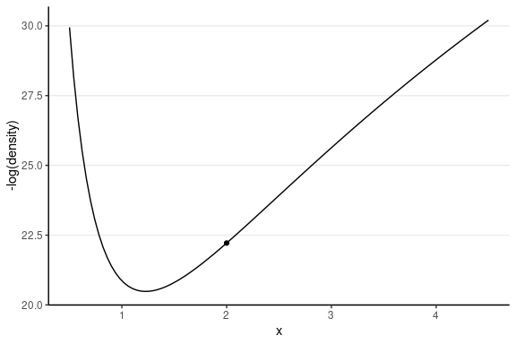

```{r setup, include = FALSE}
knitr::opts_chunk$set(echo = TRUE, comment = "#>", collapse = TRUE,
                      fig.width = 6, fig.asp = 0.618,
                      out.width = "70%", fig.align = "center")
comma <- function(x, digits. = 2L) {
    format(x, digits = digits., big.mark = ",")
}
```

```{r load-pkg, message = FALSE}
library(tidyverse)
library(plotly)  # for 3D plot
library(haven)  # for importing SPSS data
library(posterior)  # for summarizing draws
library(bayesplot)  # for plotting
theme_set(theme_classic() +
    theme(panel.grid.major.y = element_line(color = "grey92")))
```

# Hamiltonian Monte Carlo

A more recent development in MCMC is the development of algorithms under the umbrella of *Hamiltonian Monte Carlo* or *hybrid Monte Carlo* (HMC). The algorithm is a bit complex, and my goal is to help you develop some intuition of the algorithm, hopefully, enough to help you diagnose the Markov chains.

1. It produces simulation samples that are much less correlated, meaning that if you get 10,000 samples from Metropolis and 10,000 samples from HMC, HMC generally provides a much higher effective sample size (ESS). 
2. It does not require conjugate priors
3. When there is a problem in convergence, HMC tends to raise a clear red flag, meaning it goes really, really wrong.

So now, how does HMC work? First, consider a two-dimensional posterior below, which is the posterior of $(\mu, \tau)$ from a normal model.

```{r joint-dens, echo = FALSE, out.width = "100%", fig.asp = 1}
ybar <- 3.096129
s2y <- 1.356451
n <- 31
# Hyperparameters
mu_0 <- 5
sigma2_0 <- 1
kappa_0 <- 1 / 10^2
nu_0 <- 1
# Joint log density
lp_mu_sigma <- function(mu, sigma2) {
    kappa_n <- kappa_0 + n
    mu_n <- (kappa_0 * mu_0 + n * ybar) / kappa_n
    nu_n <- nu_0 + n
    sigma2_n <- (nu_0 * sigma2_0 + (n - 1) * s2y +
        kappa_0 * n / kappa_n * (ybar - mu_0)^2) / nu_n
    log_dens <- -(mu - mu_n)^2 / 2 / sigma2 * kappa_n +
        (-nu_n / 2 - 1) * log(sigma2) +
        (-nu_n * sigma2_n / 2 / sigma2)
    log_dens[is.nan(log_dens)] <- -Inf
    log_dens
}

num_gridpoints <- 51
mu_grid <- seq(2, to = 4, length.out = num_gridpoints)
sigma2_grid <- seq(0.5, to = 4.5, length.out = num_gridpoints)
grid_density <- exp(outer(mu_grid,
    Y = sigma2_grid,
    FUN = lp_mu_sigma
))
plot_ly(
    x = ~sigma2_grid, y = ~mu_grid, z = ~grid_density,
    type = "surface"
)
```

The HMC algorithm improves from the Metropolis algorithm by simulating smart proposal values. It does so by using the *gradient* of the logarithm of the posterior density. Let's first take the log of the joint density:

```{r persp-logdensity, echo = FALSE, out.width = "100%", fig.asp = 1}
grid_logdensity <- outer(mu_grid,
    Y = sigma2_grid,
    FUN = lp_mu_sigma
)
plot_ly(
    x = ~sigma2_grid, y = ~mu_grid, z = ~grid_logdensity,
    type = "surface"
)
```

Now, flip it up-side-down

```{r persp-minuslogdensity, echo = FALSE, out.width = "100%", fig.asp = 1}
grid_minuslogdensity <- - outer(mu_grid,
    Y = sigma2_grid,
    FUN = lp_mu_sigma
)
plot_ly(
    x = ~sigma2_grid, y = ~mu_grid, z = ~grid_minuslogdensity,
    type = "surface"
)
```

Imagine placing a marble on the above surface. With gravity, it is natural that the marble will have a tendency to move to the bottom of the surface. If you place the marble in a higher location, it will have a higher *potential energy* and tends to move faster towards the bottom, because that energy converts to a larger *kinetic energy*. If you place it close to the bottom, it will tend to move slower.

For simplicity, let's consider just one dimension with the following picture:

```{r lp_sigma, echo = FALSE, fig.asp = 0.4, out.width = '100%', fig.width = 8.57}
# Potential energy
lp_sigma <- function(sigma2) {
    kappa_n <- kappa_0 + n
    nu_n <- nu_0 + n
    sigma2_n <- (nu_0 * sigma2_0 + (n - 1) * s2y +
        kappa_0 * n / kappa_n * (ybar - mu_0)^2) / nu_n
    log_dens <- (-nu_n / 2 - 1) * log(sigma2) +
        (-nu_n * sigma2_n / 2 / sigma2)
    log_dens[is.nan(log_dens)] <- -Inf
    log_dens
}
p2 <- ggplot(data = data.frame(x = c(0.5, 4.5)), aes(x = x)) +
    stat_function(fun = function(x) - lp_sigma(x))
p3 <- p2 +
    geom_point(
        x = 0.6, y = -lp_sigma(0.6),
        size = 2
    )
p4 <- p2 +
    geom_point(
        x = 1.4, y = -lp_sigma(1.4),
        size = 2
    )
gridExtra::grid.arrange(p3, p4, ncol = 2)
```

For the graph on the left, the marble (represented as a dot) has high potential energy and should quickly go down to the bottom; on the right, the marble has low potential energy and should move less fast. 

> Therefore, if the sampler is near the bottom (i.e., the point with high posterior density), it tends to stay there.

But we don't want the marble to stay at the bottom without moving; otherwise, all our posterior draws will be just the posterior mode. In HMC, it moves the marble with a push, called *momentum*. The direction and the magnitude of the momentum will be randomly simulated, usually from a normal distribution. If the momentum is large, it should travel farther away; however, it also depends on the *gradient*, which is the slope in a one-dimension case.

> HMC generates a proposed value by simulating the motion of an object on a surface, based on an initial momentum with a random magnitude and direction, and locating the object after a fixed amount of time.

At the beginning of a trajectory, the marble has a certain amount of kinetic energy and potential energy, and the sum is the total amount of energy, called the *Hamiltonian*. Based on the conservation of energy, at any point in the motion, the Hamiltonian should remain constant. 

```{r leapfrog, echo = FALSE}
leapfrog_step <- function(x, rho, num_steps, eps = 1 / num_steps) {
    out <- data.frame(x = rep(NA, num_steps + 1),
                      rho = rep(NA, num_steps + 1))
    out[1, ] <- c(x, rho)
    kappa_n <- kappa_0 + n
    nu_n <- nu_0 + n
    sigma2_n <- (nu_0 * sigma2_0 + (n - 1) * s2y +
        kappa_0 * n / kappa_n * (ybar - mu_0)^2) / nu_n
    for (i in seq_len(num_steps)) {
        rho <- rho - eps / 2 *
            ((nu_n / 2 + 1) / x - nu_n * sigma2_n / 2 / x^2)
        x <- x + eps * rho
        rho <- rho - eps / 2 *
            ((nu_n / 2 + 1) / x - nu_n * sigma2_n / 2 / x^2)
        out[i + 1, ] <- c(x, rho)
    }
    out
}
```

The following shows the trajectory of a point starting at 2, with a random momentum of 0.5 in the positive direction.

```{r leapfrog-animate, echo = FALSE, eval = !file.exists("slides/images/hmc1.gif")}
library(gganimate)
num_steps <- 50
leapfrog_steps <- leapfrog_step(2, rho = 0.5, num_steps = num_steps)
p_animate <-
    p2 + geom_point(
        data = cbind(leapfrog_steps, step = 0:num_steps),
        aes(x = x, y = -lp_sigma(x))
    ) +
    labs(y = "-log(density)") +
    transition_time(step)
animate(p_animate,
    nframes = num_steps + 1, fps = num_steps / 2,
    renderer = gifski_renderer(),
    end_pause = 10
)
anim_save("slides/images/hmc1.gif")
```

```{r leapfrog-animate-cached, echo = FALSE, eval = file.exists("slides/images/hmc1.gif")}

```

This one has the same starting value, with a random momentum of 0.5 in the *negative* direction.

```{r leapfrog-animate-2, echo = FALSE, eval = !file.exists("slides/images/hmc2.gif")}
library(gganimate)
num_steps <- 50
leapfrog_steps <- leapfrog_step(2, rho = -0.5, num_steps = num_steps)
p_animate <-
    p2 + geom_point(
        data = cbind(leapfrog_steps, step = 0:num_steps),
        aes(x = x, y = -lp_sigma(x))
    ) +
    labs(y = "-log(density)") +
    transition_time(step)
animate(p_animate,
    nframes = num_steps + 1, fps = num_steps / 2,
    renderer = gifski_renderer(),
    end_pause = 10
)
anim_save("slides/images/hmc2.gif")
```

```{r leapfrog-animate-2-cached, echo = FALSE, eval = file.exists("slides/images/hmc2.gif")}

```

## Leapfrog Integrator

To simulate the marble's motion, one needs to solve a system of differential equations, which is not an easy task. A standard method is to use the so-called *leapfrog* integrator, which discretizes a unit of time into $L$*$ steps. The following shows how it approximates the motion using $L$ = 3 and $L$ = 10 steps. The red dot is the target. As can be seen, larger $L$ simulates the motion more accurately. 

```{r leapfrog-steps, echo = FALSE, fig.asp = 0.4, out.width = '100%', fig.width = 8.57}
num_steps <- 3
leapfrog_df <- cbind(
    leapfrog_step(3, rho = -0.5, num_steps = num_steps),
    step = 0:num_steps
)
final_x <- leapfrog_step(3, rho = -0.5, num_steps = 1000)[1001, 1]
p5 <- p2 + geom_point(
    data = leapfrog_df,
    aes(x = x, y = -lp_sigma(x)), col = "green"
) +
    geom_point(
        x = final_x, y = -lp_sigma(final_x),
        col = "red", size = 2, shape = 21
    ) +
    geom_path(
        data = leapfrog_df,
        aes(x = x, y = -lp_sigma(x)), col = "green"
    ) +
    labs(y = "-log(density)")
num_steps <- 10
leapfrog_df <- cbind(
    leapfrog_step(3, rho = -0.5, num_steps = num_steps),
    step = 0:num_steps
)
p6 <- p2 + geom_point(
    data = leapfrog_df,
    aes(x = x, y = -lp_sigma(x)), col = "green"
) +
    geom_point(
        x = final_x, y = -lp_sigma(final_x),
        col = "red", size = 2, shape = 21
    ) +
    geom_path(
        data = leapfrog_df,
        aes(x = x, y = -lp_sigma(x)), col = "green"
    ) +
    labs(y = "-log(density)")
gridExtra::grid.arrange(p5, p6, ncol = 2)
```

If the simulated trajectory is different from the true trajectory by a certain threshold, like the one on the left, it is called a *divergent transition*, in which case the proposed value should not be trusted. In software like STAN, it will print out a warning about that. When the number of divergent transitions is large, one thing to do is increase $L$. If that does not help, it may indicate some difficulty in a high-dimensional model, and reparameterization may be needed. 

In this course, you will use STAN to draw posterior samples. For more information on HMC, go to https://mc-stan.org/docs/2_28/reference-manual/hamiltonian-monte-carlo.html. You can also find some sample R code at http://www.stat.columbia.edu/~gelman/book/software.pdf.

## The No-U-Turn Sampler (NUTS)

Although HMC is more efficient by generating smarter proposal values, one performance bottleneck is that the motion sometimes takes a U-turn, like in some graphs above, in which the marble goes up (right) and then goes down (left), and eventually may stay in a similar location. The improvement of NUTS is that it uses a binary search tree that simulates both the forward and backward trajectory. The algorithm is complex, but to my understanding, it achieves two purposes: (a) finding the path that avoids a U-turn and (b) selecting an appropriate number of leapfrog steps, $L$. When each leapfrog step moves slowly, the search process may take a long time. With NUTS, one can control the maximum *depth* of the search tree.

See https://mc-stan.org/docs/2_28/reference-manual/hmc-algorithm-parameters.html for more information on NUTS

# Introduction to STAN

The engine used for running the Bayesian analyses covered in this course is `STAN`, as well as the `rstan` package that allows it to interface with R. `STAN` requires some programming from the users, but the benefit is that it allows users to fit a lot of different kinds of models. The goal of this lecture is not to make you an expert on `STAN`; instead, the goal is to give you a brief introduction with some sample codes so that you can study further by yourself, and know where to find the resources to write your own models when you need to.

`STAN` (http://mc-stan.org/) is itself a programming language, just like R. Strictly speaking, it is not only for Bayesian methods, as you can actually do penalized maximum likelihood and automatic differentiation, but it is most commonly used as an MCMC sampler for Bayesian analyses. It is written in C++, which makes it much faster than R (R is actually quite slow as a computational language). You can write a `STAN` program without calling R or other software, although eventually, you likely will need to use statistical software to post-process the posterior samples after running MCMC. There are interfaces of `STAN` for different programs, including R, Python, MATLAB, Julia, Stata, and Mathematica, and for us, we will be using the `RStan` interface. 

## `STAN` code

In `STAN`, you need to define a model using the `STAN` language. Below is an example for a normal model, which is saved with the file name `"normal_model.stan"`.

```{stan normal_mod, code = readLines("slides/stan/normal_model.stan"), echo = TRUE, eval = FALSE, output.var = "norm_mod"}
```

In `STAN`, anything after `//` denotes comments and will be ignored by the program. In each block (e.g., `data {}`), a statement should end with a semicolon (`;`). There are several blocks in the above `STAN` code:

- `data`: The data input for `STAN` is usually not only an R data frame, but a list that includes other information, such as sample size, number of predictors, and prior scales. Each type of data has an input type, such as 

    * `int` = integer, 

    * `real` = numbers with decimal places, 

    * `matrix` = 2-dimensional data of real numbers, 

    * `vector` = 1-dimensional data of real numbers, and 
    
    * `array` = 1- to many-dimensional data. For example `y[N]` is a one-dimensional array of integers. 

    you can set the lower and upper bounds so that `STAN` can check the input data

- `parameters`: The parameters to be estimated
- `transformed parameters`: optional variables that are transformations of the model parameters. It is usually used for more advanced models to allow more efficient MCMC sampling. 
- `model`: It includes expressions of prior distributions for each parameter and the likelihood for the data. There are many possible distributions that can be used in `STAN`. 
- `generated quantities`: Any quantities that are not part of the model but can be computed from the parameters for every iteration. Examples include posterior generated samples, effect sizes, and log-likelihood (for fit computation). 

# `RStan`

`STAN` is written in C++, which is a compiled language. This is different from programs like R, in which you can input command and get results right away. In contrast, a `STAN` program needs to be converted to something that can be executed on your computer. The benefit, however, is that the programs can be run much faster after the compilation process. 

To feed data from R to `STAN`, and import output from `STAN` to R, you will follow the steps to install the `rstan` package (https://github.com/stan-dev/rstan/wiki/RStan-Getting-Started).

## Revisiting the Note-Taking Example

We will revisit the note-taking example:

```{r nt_dat}
# Use haven::read_sav() to import SPSS data
nt_dat <- read_sav("https://osf.io/qrs5y/download")
(wc_laptop <- nt_dat$wordcount[nt_dat$condition == 0] / 100)
```

### Assemble data list in R 

First, you need to assemble a list of data for `STAN` input, which should match the specific `STAN` program. In the `STAN` program we define two components (`N` and `y') for data, so we need these two elements in an R list:

```{r nt_list}
nt_list <- list(
  N = length(wc_laptop),  # number of observations
  y = wc_laptop  # outcome variable (word counts)
)
```

### Load `rstan`

```{r load-rstan, echo=TRUE}
library(rstan)
rstan_options(auto_write = TRUE)  # save compiled STAN object
```

### Sampling the Prior

The priors used in the STAN code is $\mu \sim N(0, 10)$ and $\sigma \sim t^+_4(0, 3)$. To perform a prior predictive check, we can sample the prior. In STAN there's no direct option to do it, but we can modify the STAN code to comment out the model part:

```{stan normal_mod_prior, code = readLines("slides/stan/normal_model_prior_only.stan"), echo = TRUE, eval = FALSE, output.var = "norm_mod_prior"}
```

Then call `stan()`

```{r norm_prior, results = 'hide'}
norm_prior <- stan(
    file = "slides/stan/normal_model_prior_only.stan", data = nt_list,
    seed = 1234,  # for reproducibility
    # Below are optional arguments
    iter = 2000,  # number of iterations
    chains = 4,  # number of chains
    cores = 1  # can change to 2+ for parallel sampling
)
```

We can extract the prior predictive draws, and plot the data:

```{r prior-pc}
set.seed(6)
y_tilde <- as.matrix(norm_prior, pars = "y_rep")
# Randomly sample 100 data sets (to make plotting faster)
selected_rows <- sample.int(nrow(y_tilde), size = 100)
ppc_dens_overlay(wc_laptop, yrep = y_tilde[selected_rows, ], bw = "SJ")
```

### Sampling the Posterior

```{r norm_fit, results = 'hide'}
norm_fit <- stan(
    file = "slides/stan/normal_model.stan", data = nt_list,
    seed = 1234  # for reproducibility
)
```

### Summarize the results

After you call the `stan` function in R, it will compile the `STAN` program, which usually takes a minute (but more for more complex models). Then it starts sampling. You can now see a summary of the results by printing the results:

```{r print-fit}
print(norm_fit, pars = c("mu", "sigma"))
```

#### Table

You can use the `posterior::summarize_draws()` function to get a table:

```{r tab-fit}
norm_fit %>%
    # Convert to `draws` object to work with the `posterior` package
    as_draws() %>%
    # Extract only mu and sigma
    subset_draws(variable = c("mu", "sigma")) %>%
    # Get summary
    summarize_draws() %>%
    # Use `knitr::kable()` for tabulation
    knitr::kable()
```

#### Plots

```{r plot-fit}
# Posterior distributions
mcmc_hist(norm_fit, pars = c("mu", "sigma"))
# Scatter plot matrix
mcmc_pairs(norm_fit, pars = c("mu", "sigma"))
# Trace plots
mcmc_trace(norm_fit, pars = c("mu", "sigma"))
# Rank plots
mcmc_rank_hist(norm_fit, pars = c("mu", "sigma"))
```

And you can also use the `shinystan` package to visualize the results:

```{r shinystan-fit, eval = FALSE}
shinystan::launch_shinystan(norm_fit)
```

### Posterior Predictive

We can extract the posterior predictive draws, and plot the data:

```{r ppc}
# Same code as prior predictive check
y_tilde <- as.matrix(norm_fit, pars = "y_rep")
# Randomly sample 100 data sets (to make plotting faster)
selected_rows <- sample.int(nrow(y_tilde), size = 100)
ppc_dens_overlay(wc_laptop, yrep = y_tilde[selected_rows, ], bw = "SJ")
```

## Resources

`STAN` is extremely powerful and can fit almost any statistical model, but the price is that it takes more effort to code the model. To learn more about `STAN`, please check out https://mc-stan.org/users/documentation/ for the manual, examples of some standard models, and case studies (including more complex models like item response theory). Here are some case studies that may be of interest to you:

- Regression (linear, logistic, ordered logistic): https://mc-stan.org/docs/2_29/stan-users-guide/linear-regression.html
- Item response theory: https://mc-stan.org/docs/2_29/stan-users-guide/item-response-models.html
- Time series: https://mc-stan.org/docs/2_29/stan-users-guide/time-series.html
- Meta-analysis: https://mc-stan.org/docs/2_29/stan-users-guide/meta-analysis.html
- Clustering models: https://mc-stan.org/docs/2_29/stan-users-guide/clustering.html
- Latent class model: https://mc-stan.org/users/documentation/case-studies/Latent_class_case_study.html


See https://cran.r-project.org/web/packages/rstan/vignettes/rstan.html for a vignette for working with the `rstan` package. 

Though fitting simple models in `STAN` may sometimes be more work, for complex models, `STAN` could be a lifesaver as it would be tough to fit some of those models with other approaches.

Things to pay attention for STAN:

- Define the type
- Define the bound
- End with a ";"
- Different format for a for loop

<!-- The following chunk is only used in the website -->

```{r, echo = FALSE, results = 'asis', eval = file.exists("distill-hack.RMarkdown")}
knitrenv <- knitr::knit_global()
assign("knit_input", knitr::current_input(), knitrenv)
append_res <- knitr::knit_child("distill-hack.RMarkdown",
    envir = knitrenv, quiet = TRUE
)
cat(append_res)
```
