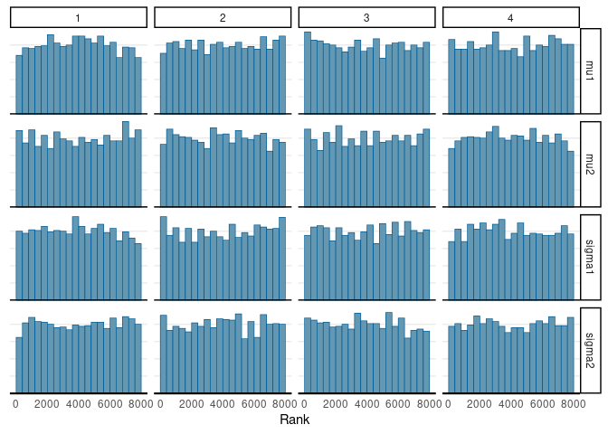

HW 9 Template
================
Mark Lai
2022-04-10

-   [Research Question](#research-question)
-   [Variables](#variables)
    -   [Import Data](#import-data)
    -   [Variable Summary](#variable-summary)
-   [Model](#model)
    -   [Running Stan](#running-stan)
-   [Results](#results)

``` r
library(ggplot2)  # for plots
library(magrittr)  # for `%>%` operator
library(here)
library(readxl)  # for reading excel files
library(modelsummary)  # for summarizing data
library(rstan)
rstan_options(auto_write = TRUE)  # save compiled STAN object
options(mc.cores = 2)  # use two cores
library(posterior)
library(bayesplot)
theme_set(theme_classic() +
    theme(panel.grid.major.y = element_line(color = "grey92")))
```

# Research Question

> Is there difference in student evaluation rating for native and
> non-native English-speaking instructors?

# Variables

-   `profevaluation`: evaluation rating of the instructor: 1 (very
    unsatisfactory) to 5 (excellent)
-   `nonenglish`: 1 = non-native English speakers, 0 = native-English
    speakers

## Import Data

``` r
beauty <- read_excel(here("data", "ProfEvaltnsBeautyPublic.xls"))
```

## Variable Summary

``` r
datasummary(profevaluation  * 
                (N + Mean + SD + Min + Max + Histogram) ~ 
                factor(nonenglish, labels = c("Native", "Non-Native")),
            data = beauty)
```

|                |           |   Native | Non-Native |
|:---------------|:----------|---------:|-----------:|
| profevaluation | N         |      435 |         28 |
|                | Mean      |     4.19 |       3.94 |
|                | SD        |     0.55 |       0.43 |
|                | Min       |     2.30 |       3.40 |
|                | Max       |     5.00 |       4.80 |
|                | Histogram | ▁▁▃▄▄▆▇▅ |  ▇▆▅▁▁▂▁▇▂ |

# Model

Let *Y* = profevaluation, *G* = nonenglish

Model:
$$
  \\begin{aligned}
    Y\_{i, G = 0} & \\sim N(\\mu_1, \\sigma_1) \\\\
    Y\_{i, G = 1} & \\sim N(\\mu_2, \\sigma_2)
  \\end{aligned}
$$

Prior:
$$
  \\begin{aligned}
    \\mu_1 & \\sim N(3, 2) \\\\
    \\mu_2 & \\sim N(3, 2) \\\\
    \\sigma_1 & \\sim N^+(0, 2) \\\\
    \\sigma_2 & \\sim N^+(0, 2)
  \\end{aligned}
$$

## Running Stan

We used 4 chains, each with 4,000 iterations (first 2,000 as warm-ups).

``` r
# 1. form the data list for Stan
stan_dat <- with(beauty,
    list(N1 = sum(nonenglish == 0),
         N2 = sum(nonenglish == 1),
         y1 = profevaluation[which(nonenglish == 0)],
         y2 = profevaluation[which(nonenglish == 1)])
)
# 2. Run Stan
m1 <- stan(
    file = here("hw/stan", "normal_2group.stan"),
    data = stan_dat,
    seed = 1234,  # for reproducibility
    iter = 4000
)
```

# Results

As shown in the graph below, the chains mixed well.

``` r
mcmc_rank_hist(m1, pars = c("mu1", "mu2", "sigma1", "sigma2"))
```

<!-- -->

The following table shows the posterior distributions of
*μ*<sub>1</sub>, *μ*<sub>2</sub>, *σ*<sub>1</sub>, *σ*<sub>2</sub>, and
*μ*<sub>2</sub> − *μ*<sub>1</sub>.

``` r
summ_m1 <- as_draws_df(m1) %>%
    subset_draws(variable = c("mu1", "mu2", "sigma1", "sigma2")) %>%
    mutate_variables(`$\\mu_2 - \\mu_1$` = mu2 - mu1) %>%
    summarise_draws()
knitr::kable(summ_m1, digits = 2)
```

<table>
<thead>
<tr>
<th style="text-align:left;">
variable
</th>
<th style="text-align:right;">
mean
</th>
<th style="text-align:right;">
median
</th>
<th style="text-align:right;">
sd
</th>
<th style="text-align:right;">
mad
</th>
<th style="text-align:right;">
q5
</th>
<th style="text-align:right;">
q95
</th>
<th style="text-align:right;">
rhat
</th>
<th style="text-align:right;">
ess_bulk
</th>
<th style="text-align:right;">
ess_tail
</th>
</tr>
</thead>
<tbody>
<tr>
<td style="text-align:left;">
mu1
</td>
<td style="text-align:right;">
4.19
</td>
<td style="text-align:right;">
4.19
</td>
<td style="text-align:right;">
0.03
</td>
<td style="text-align:right;">
0.03
</td>
<td style="text-align:right;">
4.15
</td>
<td style="text-align:right;">
4.23
</td>
<td style="text-align:right;">
1
</td>
<td style="text-align:right;">
9815.02
</td>
<td style="text-align:right;">
5526.92
</td>
</tr>
<tr>
<td style="text-align:left;">
mu2
</td>
<td style="text-align:right;">
3.94
</td>
<td style="text-align:right;">
3.94
</td>
<td style="text-align:right;">
0.09
</td>
<td style="text-align:right;">
0.09
</td>
<td style="text-align:right;">
3.79
</td>
<td style="text-align:right;">
4.09
</td>
<td style="text-align:right;">
1
</td>
<td style="text-align:right;">
8060.94
</td>
<td style="text-align:right;">
5497.07
</td>
</tr>
<tr>
<td style="text-align:left;">
sigma1
</td>
<td style="text-align:right;">
0.55
</td>
<td style="text-align:right;">
0.55
</td>
<td style="text-align:right;">
0.02
</td>
<td style="text-align:right;">
0.02
</td>
<td style="text-align:right;">
0.52
</td>
<td style="text-align:right;">
0.58
</td>
<td style="text-align:right;">
1
</td>
<td style="text-align:right;">
9254.43
</td>
<td style="text-align:right;">
6005.89
</td>
</tr>
<tr>
<td style="text-align:left;">
sigma2
</td>
<td style="text-align:right;">
0.46
</td>
<td style="text-align:right;">
0.45
</td>
<td style="text-align:right;">
0.07
</td>
<td style="text-align:right;">
0.06
</td>
<td style="text-align:right;">
0.36
</td>
<td style="text-align:right;">
0.57
</td>
<td style="text-align:right;">
1
</td>
<td style="text-align:right;">
8234.16
</td>
<td style="text-align:right;">
5538.75
</td>
</tr>
<tr>
<td style="text-align:left;">
*μ*<sub>2</sub> − *μ*<sub>1</sub>
</td>
<td style="text-align:right;">
-0.25
</td>
<td style="text-align:right;">
-0.25
</td>
<td style="text-align:right;">
0.09
</td>
<td style="text-align:right;">
0.09
</td>
<td style="text-align:right;">
-0.40
</td>
<td style="text-align:right;">
-0.10
</td>
<td style="text-align:right;">
1
</td>
<td style="text-align:right;">
7760.00
</td>
<td style="text-align:right;">
5688.86
</td>
</tr>
</tbody>
</table>

The analysis showed that on average, non-native speaking instructors
received a lower evaluation rating than native speaker instructors, with
a posterior mean of -0.25 and a 90% CI of \[-0.4, -0.1\].
