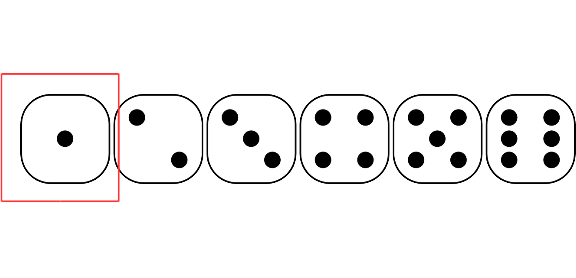
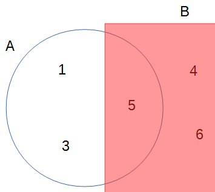

```{r setup, include = FALSE}
knitr::opts_chunk$set(echo = TRUE, comment = "#>", collapse = TRUE,
                      fig.width = 6, fig.asp = 0.618,
                      out.width = "70%", fig.align = "center",
                      fig.show = "hold")
comma <- function(x, digits = 2L) format(x, digits = digits, big.mark = ",")
# Load required packages
library(tidyverse)
theme_set(theme_bw() +
    theme(panel.grid.major.y = element_line(color = "grey92")))
```

# History of Probability

## Games of chance

Correspondence between French Mathematicians (Pierre de Fermat and Blaise Pascal) on gambling problem by Antoine Gombaud, Chevalier de Méré. The problem is roughly of the form^[see the exact form at https://en.wikipedia.org/wiki/Problem_of_points)]:

> Imagine two people playing a multi-round game. In each round, each person has an equal chance of winning. The first person who wins six rounds will get a huge cash prize. Now, consider a scenario in which A and B have played six rounds, where A has won five and B has won one. At that time, the game had to be stopped due to a thunderstorm. Since neither A and B have reached six wins, instead of giving the prize to either one of them, they agree to divide up the prize. What would be a fair way to do so?

The discussion led to the formalization of using mathematics to solve the problem. Basically, one way is to say if A has a 97% chance to win the prize eventually and B has a 3% chance, then A should get 97% of the prize.

# Different Ways to Interpret Probability

There are multiple perspectives for understanding probability.[^Prob] What you've learned in your statistics training is likely based on the *frequentist* interpretation of probability (and thus frequentist statistics), whereas what you will learn in this class have the foundation on the *subjectivist* interpretation of probability. Understanding the different perspectives on probability is helpful for understanding the Bayesian framework. 

[^Prob]: See http://plato.stanford.edu/entries/probability-interpret/ for more information

> You don't need to commit to one interpretation of probability in order to conduct Bayesian data analysis.

## Classical Interpretation

This is an earlier perspective and is based on counting rules. The idea is that probability is equally distributed among all "indifferent" outcomes. "Indifferent" outcomes are those where a person does not have any evidence to say that one outcome is more likely than another. For example, when one throws a die, one does not think that a certain number is more likely than another unless one knows that the die is biased. In this case, there are six equally likely outcomes, so the probability of each outcome is 1 / 6.



## Frequentist Interpretation

The frequentist interpretation states that probability is essentially the long-run relative frequency of an outcome. For example, to find the probability of getting a "1" when throwing a die, one can repeat the experiment many times, as illustrated below:

```{r die_outcome, echo = FALSE}
set.seed(5)
die_outcome <- sample(1:6, 1e4, replace = TRUE)
knitr::kable(cbind(Trial = 1:10, Outcome = die_outcome[1:10]),
             align = c("c", "c"))
```

And we can plot the relative frequency of "1"s in the trials:

```{r plot-frequency, echo = FALSE, out.width = "100%", fig.width = 8.57}
p0 <- ggplot(
    tibble(x = 1:10, y = die_outcome[1:10]),
    aes(x = x, y = cumsum(y == 1) / x)
) +
    geom_line() +
    labs(x = "Number of trials", y = 'Relative frequency of "1"')
p1 <- p0 + geom_point() +
    scale_x_continuous(breaks = 1:10)
p2 <- p0 %+% tibble(x = 1:100, y = die_outcome[1:100]) +
    geom_hline(yintercept = 1 / 6, col = "red", linetype = "dashed")
p3 <- p0 %+% tibble(x = 1:1e3, y = die_outcome[1:1e3]) +
    geom_hline(yintercept = 1 / 6, col = "red", linetype = "dashed")
p4 <- p0 %+% tibble(x = 1:1e4, y = die_outcome) +
    geom_hline(yintercept = 1 / 6, col = "red", linetype = "dashed")
gridExtra::grid.arrange(p1, p2, p3, p4, nrow = 2)
```

As you can see, with more trials, the relative frequency approaches 1 / 6. It's the reason why in introductory statistics, many of the concepts require you to think in terms of repeated sampling (e.g., sampling distribution, $p$-values, standard errors, confidence intervals), because probability in this framework is only possible when the outcome can be repeated. It's also the reason why we don't talk about something like:

- the probability of the null hypothesis being true, or
- the probability that the population mean is in the interval [75.5, 80.5],

because the population is fixed and cannot be repeated. Only the samples can be repeated, so probability in frequentist statistics is only about samples. 

### Problem of the single case

Because of the frequentist's reference to long-run relative frequency, under this framework, it does not make sense to talk about the probability of an event that cannot be repeated. For example, it does not make sense to talk about 
- the probability that the Democrats/Republicans will win the 2024 US Presidential Election, or 
- the probability that the LA Rams winning the 2022 Super Bowl, or 
- the probability that it will rain on Christmas Day in LA in 2022,
because all these are specific events that cannot be repeated. However, it is common for lay people to talk about probabilities or chances for these events.

## Subjectivist Interpretation

The frequentist interpretation is sometimes called the "objectivist view," as the reference of probability is based on empirical evidence of long-run relative frequency (albeit hypothetical in many cases). In contrast, the *subjectivist* view of probability is based on one's belief. For example, when I say that the probability of getting a "1" from rolling a die is 1 / 6, it reflects the state of my mind about the die. My belief can arise from different sources: Maybe I make the die and know it is a fair one; maybe I saw someone throwing the die 1,000 times, and the number of "1"s was close to 1,000 / 6, or maybe someone I trust and with authority says that the die has a 1-in-6 chance of showing a "1".

The "subjective" component has been criticized a lot by frequentist scholars, sometimes unfairly. To be clear, what "subjective" here means is that probability reflects the state of one's mind instead of the state of the world, and so it is totally fine that two people can have different beliefs about the same event. However, it does not mean that probability is arbitrary, as the beliefs are subjected to the constraints of the axioms of probability as well as the condition that the person possessing such beliefs is *rational*.[^subjectivist] Therefore, if two persons are exposed to the same information, they should form similar, though likely not identical, beliefs about the event.

[^subjectivist]: In a purely subjectivist view of probability, assigning a probability $P$ to an event does not require any justifications, as long as it follows the axioms of probability. For example, I can say that the probability of me winning the lottery and thus becoming the wealthiest person on earth tomorrow is 95%, which by definition would make the probability of me not winning the lottery 5%. Most Bayesian scholars, however, do not endorse this version of subjectivist probability and require justifications of one's beliefs (that has some correspondence to the world).

The subjective interpretation works perfectly fine with single events, as one can have a belief about whether it rains on a particular day or a belief about a particular election result.

### Calibrating a subjective belief

In order to represent one's belief by probability, one needs to assign a nonzero value to every plausible outcome of an event. This has been the job of odds-makers for a long time. Indeed, a lot of the development in the field of probability has to do with coming up with a fair bet. The process of assigning probabilities to outcomes of an event according to one's belief is called *calibration*. For example, consider three possible outcomes for tomorrow's weather. For simplicity, consider three mutually exclusive possible outcomes: sunny, cloudy, and rainy.

To calibrate my belief, consider first if you bet $10, and the return is (a) $30 for sunny, (b) $30 for cloudy, and (c) $30 for rainy. Which one will you bet? If you're like me in LA, I'm pretty sure I'll bet on (a), as I think that it is more likely to have a sunny day. This means that setting $P$(sunny) = $P$(cloudy) = $P$(rainy) = 1 / 3 is not a good reflection of my belief.

Now consider the bet with the returns (a) $20 for sunny, (b) $30 for cloudy, and (c) $60 for rainy. This would reflect the belief that there is a 50% chance of a sunny day, 33.33% chance of a cloudy day, and 16.67% chance of a rainy day. Will you take the bet? This is an improvement from the last one, but I would still say a sunny day is a good bet, which suggests that the probability of 50% is too low for a sunny day. The idea is to continue iterating until it is hard to consider (a), (b), or (c) as a clear betting favorite. For me, this would end up being something like (a) $16.7 for sunny, (b) $33.3 for cloudy, and (c) $100 for rainy, which would correspond to 60% sunny, 30% cloudy, and 10% rainy.

If it's hard for you to consider the gambling analogy, an alternative way is to consider how many times is a sunny day more likely than a non-sunny day, and how many times is a cloudy day more likely than a rainy day. For example, I may consider a sunny day to be twice as likely as a non-sunny day, which would give the probability of a sunny day to be 66.67%. Then, if I also think that a cloudy day is three times as likely as a rainy day, I would assign a probability of 33.33% $\times$ 3 / 4 = 25% for a cloudy day, and a probability of 33.33% $\times$ 1 / 4 = 8.33% for a rainy day.

The process of calibrating one's belief plays a key role in Bayesian data analysis, namely in the form of formulating a *prior* probability distribution.

# Basics of Probability

Kolmogorov axioms: 

> - For an event $A_i$ (e.g., getting a "1" from throwing a die)
>     * $P(A_i) \geq 0$ [All probabilities are non-negative]
>     * $P(A_1 \cup A_2 \cup \cdots) = 1$ [Union of all possibilities is 1]
>     * $P(A_1) + P(A_2) = P(A_1 \text{ or } A_2)$ [Addition rule]

Consider two events, for example, on throwing a die,

- $A$: The number is odd
- $B$: The number is larger than or equal to 4

Assuming that die is (believed to be) fair, you can verify that the probability of $A$ is $P(A)$ = 3 / 6 = 1 / 2, and the probability of $B$ is also $P(B)$ = 3 / 6 = 1 / 2. 

## Probability Distributions

- Discrete event (e.g., outcome of throwing a die or an election): probability *mass*. The probability is nonzero, at least for some outcomes. The graph below on the left shows the probability mass of the sum of the numbers from two dice.

- Continuous event (e.g., temperature): probability *density*. The probability is basically zero for any outcome. Instead, the probability density is approximated by $P(A - h < a \leq A + h) / (2h)$ for a very small $h$. 
    * For example, to find the probability density that a person's well-being score is 80, we first find the probability that a person scores between 79.5 and 80.5 (or 79.9995 and 81.0005), and divide that probability by 1 (or 0.001). See the shaded area of the graph below on the right.

<aside>
For many problems in the social and behavioral sciences, the measured variables are not truly continuous, but we still use continuous distributions to approximate them. 
</aside>

```{r prob-mass-density, echo = FALSE, out.width = "100%", fig.width = 8.57}
# Probability mass
two_dice_probs <- data.frame(x = 2:12,
                             prob = c(table(outer(1:6, 1:6, FUN = "+"))) / 36)
p_mass <- ggplot(two_dice_probs, aes(x = x, y = prob)) +
    geom_col(width = 0.05) +
    geom_point() +
    scale_x_continuous(breaks = 2:12) +
    labs(x = "Sum of two dice", y = "Probability mass")
# Probability density
shaded <- data.frame(x = seq(79.5, 80.5, length.out = 11))
shaded$dens <- dnorm(shaded$x, mean = 78, sd = 5)
p_dens <- ggplot(data.frame(x = c(75, 85)), aes(x = x)) +
    stat_function(fun = dnorm, args = list(mean = 78, sd = 5)) +
    geom_ribbon(data = shaded, aes(ymin = 0, ymax = dens), alpha = 0.3) +
    labs(x = "Score", y = "Probability density")
gridExtra::grid.arrange(p_mass, p_dens, ncol = 2)
```

> For this course, as in the textbook, we use $P(x)$ to mean both the probability mass for an outcome $x$ when the event is discrete, and the probability density at an outcome $x$ when the event is continuous. 

### Example: Normal Distribution

$$P(x) = \frac{1}{\sqrt{2 \pi} \sigma} \exp\left(-\frac{1}{2}\left[\frac{x - \mu}{\sigma}\right]^2\right)$$

```{r normal-density}
# Write a function to compute the density of an outcome x for a normal distribution
my_normal_density <- function(x, mu, sigma) {
    exp(- ((x - mu) / sigma) ^2 / 2) / (sigma * sqrt(2 * pi))
}
# For example, density at x = 36 in a normal distribution with mu = 50 and sigma = 10
my_normal_density(36, mu = 50, sigma = 10)
```

## Summarizing a Probability Distribution

While it is useful to know the probability mass/density of every possible outcome, in many situations, it is helpful to summarize a distribution by some numbers.

### Central Tendency

- Mean: $E(X) = \int x \cdot P(x) d x$
- Median: 50th percentile; the median of $X$ is $\mathit{Mdn}_X$ such that $P(X \leq \mathit{Mdn}_X)$ = 1 / 2
- Mode: A value with maximum probability mass/density

```{r central-tendency, echo = FALSE}
ggplot(data.frame(x = c(0, 10)), aes(x = x)) +
    stat_function(fun = dchisq, args = list(df = 4)) +
    geom_vline(aes(xintercept = 4,
                   col = "mean", linetype = "mean")) +
    geom_vline(aes(xintercept = 4 * (1 - 2 / 9 / 4) ^ 3,
               col = "median", linetype = "median")) +
    geom_vline(aes(xintercept = 2, col = "mode",
               linetype = "mode")) +
    labs(y = "Probability density", col = NULL, linetype = NULL)
```

### Dispersion

- Variance: $V(X) = E[X - E(X)]^2$
    * Standard deviation: $\sigma(X) = \sqrt{V(X)}$
- Median absolute deviation (MAD): $1.4826 \times \mathit{Mdn}(|X - \mathit{Mdn}_X|)$

### Interval

Use $C(X)$ to denote an interval. A $W$% interval means $P(X \in C[X]) \approx W\%$

- One-sided interval: $C(X)$ is half-bounded
- Symmetric $W$% interval: $C(X) = [L(X), U(X)]$ is bounded, with $P(X < L[X]) = P(X > U[X]) \approx W\% / 2$
    * Also called *equal-tailed* interval
- Highest density $W$% interval (HDI): $P(x_c) \geq P(x_o)$ for every $x_c$ in $C(X)$ and every $x_o$ outside $C(X)$. In general, the HDI is the shortest $W$% interval.

The plot below shows several 80% intervals

```{r interval, echo = FALSE}
hdi_lower <- optim(.1,
                   function(a) diff(qchisq(c(a, .8 + a), df = 4)),
                   method = "L-BFGS-B",
                   lower = 0, upper = .2)$par
ggplot(data.frame(x = c(0, 10)), aes(x = x)) +
    stat_function(fun = dchisq, args = list(df = 4)) +
    geom_errorbarh(aes(xmin = 0, xmax = qchisq(.8, df = 4),
                       y = 0.02, height = 0.02,
                       color = "One-sided",
                       linetype = "One-sided")) +
    geom_errorbarh(aes(xmin = qchisq(.1, df = 4),
                       xmax = qchisq(.9, df = 4),
                       y = 0.04, height = 0.02,
                       color = "Symmetric",
                       linetype = "Symmetric")) +
    geom_errorbarh(aes(xmin = qchisq(hdi_lower, df = 4),
                       xmax = qchisq(hdi_lower + .8, df = 4),
                       y = 0.06, height = 0.02,
                       color = "HDI",
                       linetype = "HDI")) +
    labs(y = "Probability density", col = NULL, linetype = NULL)
```

### Computing Summaries of Sample Distributions Using R

```{r sim_x, fig.show = "asis"}
# Simulate data from a half-Student's t distribution with df = 4, and call it sim_s
sim_s <- rt(10000, df = 4)  # can be both positive and negative
sim_s <- abs(sim_s)  # take the absolute values
qplot(sim_s, binwidth = 0.1)  # quick histogram plot

# Central tendency
# (note: the mode is difficult to compute for continuous variables, 
# and rarely used in this course.)
c(
    mean = mean(sim_s),
    median = median(sim_s),
    mode = density(sim_s, bw = "SJ")$x[which.max(density(sim_s, bw = "SJ")$y)]
)

# Dispersion
c(
    variance = var(sim_s),
    sd = sd(sim_s),
    mad = mad(sim_s)
)

# 80% Interval
c(`0%` = 0, quantile(sim_s, probs = .8))  # right-sided
c(quantile(sim_s, probs = .2), `100%` = Inf)  # left-sided
quantile(sim_s, probs = c(.1, .9))  # equal-tailed/symmetric
HDInterval::hdi(sim_s)
```

## Multiple Variables

- Joint probability: $P(X, Y)$
- Marginal probability: 
$$P(X) = \int P(X, y) dy$$
$$P(Y) = \int P(x, Y) dx$$
    * The probability that outcome $X$ happens, regardless of what values $Y$ take.

```{r marginal-dist, echo = FALSE, fig.asp = 1}
sim_df <- MASS::mvrnorm(1000, mu = c(0, 0),
                        Sigma = matrix(c(1, 0.3, 0.3, 1),
                                       nrow = 2))
sim_df <- as.data.frame(sim_df)
names(sim_df) <- c("x", "y")
p <- ggplot(sim_df, aes(x = x, y = y)) +
    geom_point(alpha = 0.3) +
    theme(legend.position = "none")
ggExtra::ggMarginal(p, type = "density")
```

### Conditional Probability

Conditional probability is the probability of an event given some other information. In the real world, you can say that everything is conditional. For example, the probability of getting an odd number on throwing a die is 1/2 is conditional on the die being fair. We use $P(A \mid B)$ to represent the <span style="color:red">the conditional probability of event $A$ given event $B$.</span>. 

Continuing from the previous example, $P(A \mid B)$ is the conditional probability of getting an odd number, *knowing that the number is at least 4*. By definition, conditional probability is the probability that both $A$ and $B$ happen, divided by the probability that $B$ happens. 

> $P(A \mid B) = \dfrac{P(A, B)}{P(B)}$

In the example, $P(A, B)$ = 1 / 6, because 5 is the only even number $\geq$ 4 when throwing a die. Thus,
\begin{align}
    P(A \mid B) & = 1 / 3 \\
             & = \frac{P(A, B)}{P(B)} \\
             & = \frac{1 / 6}{1 / 2}
\end{align}

This picture should make it clear:

{width=50%}

> It's important to recognize that $P(A \mid B) \neq P(B \mid A)$. For example, when throwing a die, $P$(number is six | even number) = 1/3, but $P$(even number | number is six) is 1.

### Independence

Two events, $A$ and $B$, are independent if 

> $P(A \mid B) = P(A)$

This means that any knowledge of $B$ does not (or should not) affect one's belief about $A$. Consider the example:

- $A$: A die shows five or more
- $B$: A die shows an odd number

Here is the joint probability

|     | >= 5 | <= 4 |
|-----|------|------|
| odd | 1/6  | 2/6  |
| even| 1/6  | 2/6  |

So the conditional probability of $P$(>= 5 | odd) = (1/6) / (1/2) = 1/3, which is the same as $P$(>= 5 | even) = (1/6) / (1/2) = 1/3. Similarly it can be verified that $P$(<= 4 | odd) = $P$(<= 4 | even) = 2/3. Therefore, $A$ and $B$ are independent.

On the other hand, for the example

- $A$: A die shows four or more
- $B$: A die shows an odd number

the joint probabilities are

|     | >= 4 | <= 3 |
|-----|------|------|
| odd | 1/6  | 2/6  |
| even| 2/6  | 1/6  |

Obviously, $A$ and $B$ are not independent because once we know that the number is four or above, it changes the probability of whether it is an odd number or not. 

Independence can also be expressed as

> With independence, $P(A, B) = P(A) P(B)$

### Law of Total Probability

When we talk about conditional probability, like $B_1$ = 4 or above and $B_2$ = 3 or below, we can get $P(A \mid B_1)$ and $P(A \mid B_2)$ (see the figure below), we refer $P(A)$ as the _marginal probability_, meaning that the probability of $A$ <span style="color:red"> without knowledge of $B$</span>.


If $B_1, B_2, \cdots, B_n$ are all mutually exclusive possibilities for an event (so they add up to a probability of 1), then by the <span style="color:red"> law of total probability</span>, 

> \begin{align}
    P(A) & = P(A, B_1) + P(A, B_2) + \cdots + P(A, B_n)  \\
         & = P(A \mid B_1)P(B_1) + P(A \mid B_2)P(B_2) + \cdots + P(A \mid B_n) P(B_n)  \\
         & = \sum_{k = 1}^n P(A \mid B_k) P(B_k)
  \end{align}

<!--

## Bayes's Theorem

The Bayes's theorem is, surprisingly (or unsurprisingly), very simple:

> $$P(B | A) = \frac{P(A | B) P(B)}{P(A)}$$

More generally, we can expand it to incorporate the law of total probability tomake it more applicable to data analysis. Consider $B_i$ as one of the $n$ many possible mutually exclusive events, then
\begin{align}
  P(B_i | A) & = \frac{P(A | B_i) P(B_i)}{P(A)}  \\
             & = \frac{P(A | B_i) P(B_i)}
                      {P(A | B_1)P(B_1) + P(A | B_2)P(B_2) + \cdots + 
                       P(A | B_n)P(B_n)} \\
             & = \frac{P(A | B_i) P(B_i)}{\sum_{k = 1}^n P(A | B_k)P(B_k)}
\end{align}

If $B_i$ is a continuous variable, we will replace the sum by an integral, 
$$P(B_i | A) = \frac{P(A | B_i) P(B_i)}{\int_k P(A | B_k)P(B_k)}$$
The denominator is not important for practical Bayesian analysis, therefore, it is sufficient to write the above equality as 

> $$P(B_i | A) \propto P(A | B_i) P(B_i)$$

***

-->
